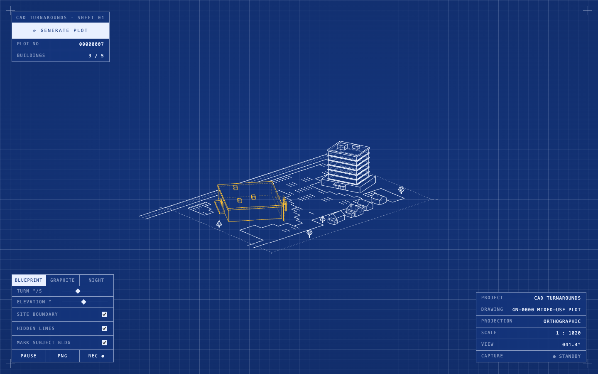
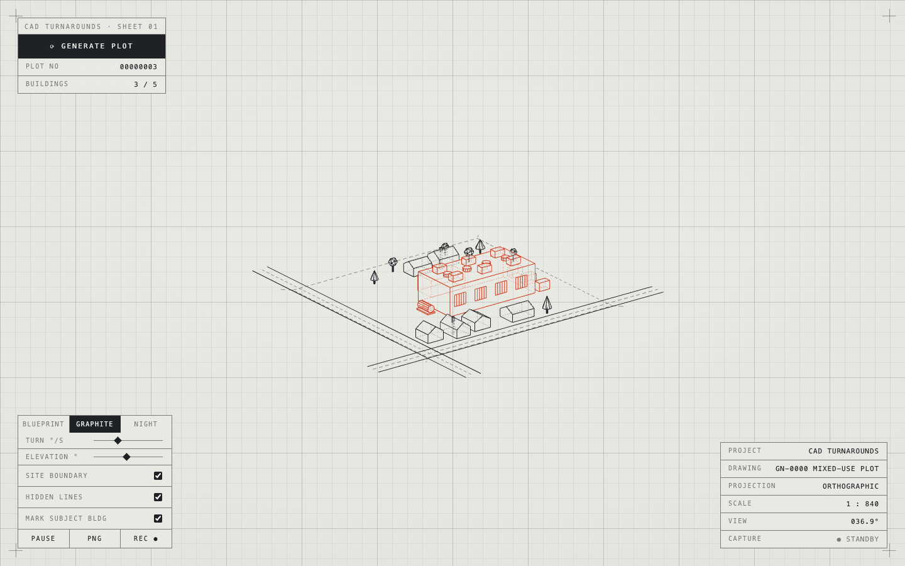
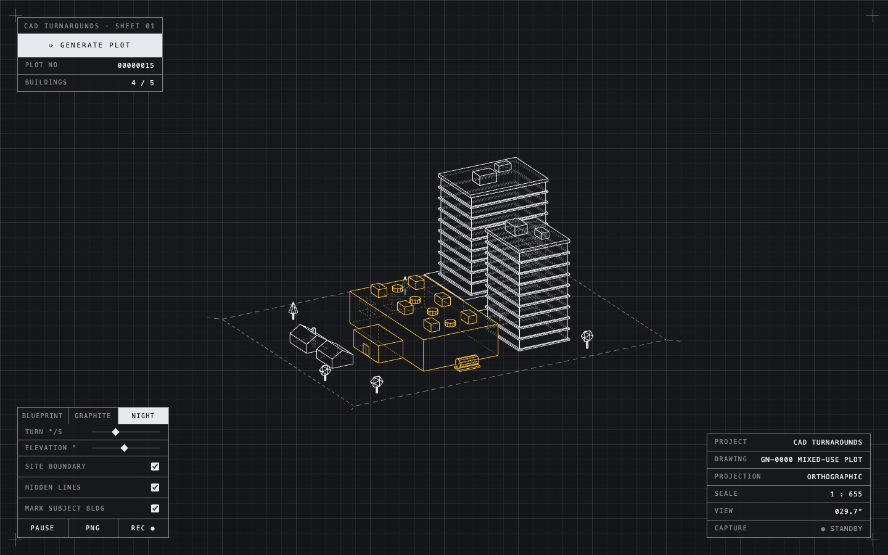

# cad-turnarounds

Procedural CAD-style building turnarounds for three.js. Generates small mixed-use plots — malls, parking decks, offices, data centers, and little gabled houses in between (max 5 buildings), sometimes with a striped open-air parking lot and a scatter of drafting-style trees (cone or faceted-ball canopies) — and renders them as clean hidden-line wireframes on an orthographic turntable with a **fully transparent background**. ~40% of plots come out as a German-style retail park (Fachmarktzentrum): buildings ring a shared central parking lot with their entrances facing in. The lot is generated afterwards to fill whatever irregular space the buildings left — drawn as **one union outline** that hugs the angled walls, with clustered (not wall-to-wall) stall markings and an access drive cut into the outline that leads out past the boundary.

Orientation works the way game city generators do it (roads first, buildings inherit alignment from their frontage): a street plan is decided before placement, the street-side cluster of buildings aligns exactly to the street, everything else aligns to the plot's own grid, and the rare freestanding landmark ignores both. Streets are laid tangent to the built-up edge (kerb pair + dashed centerline, overshooting like through-roads), and overlap between angled footprints is resolved with oriented-rectangle separating-axis tests. Visible edges are crisp, occluded edges are faint dashed lines, drafting style.

Framework agnostic: one class, one canvas, plain method calls. Works in React, Svelte, Vue, vanilla — anything that can hand over a DOM element.



| Graphite theme | Night theme |
| --- | --- |
|  |  |

## Demo

```sh
npx serve .        # or: python3 -m http.server
# open http://localhost:3000 — Generate button, themes, PNG / WebM export
```

## Install

```sh
npm i cad-turnarounds three
```

`three` is a peer dependency (>= 0.150).

## Usage

```js
import { CadTurnaround } from 'cad-turnarounds';

const ct = new CadTurnaround(canvasOrContainer, {
  lineColor: 0x1e2226,   // pick per target background; render bg is transparent
  speed: 24,             // turntable, deg/s
  elevation: 22,         // camera elevation, deg
  maxBuildings: 5,
  seed: 0xC0FFEE,        // optional: reproducible plot
  highlight: true,       // mark the subject building ("the one we're building")
  highlightColor: 0xffc233,
  onFrame: ({ yawDeg }) => {},
});

ct.generate();                      // new random plot → returns seed
ct.generate(0xC0FFEE);              // same seed → same plot
ct.pause(); ct.play();
ct.setElevation(30); ct.setSpeed(12);
ct.setLineColor(0xffffff);
ct.setHiddenLines(false);           // toggle dashed back-edges
ct.setSiteBoundary(false);          // toggle dashed site rectangle
ct.setHighlight(true);              // mark / unmark the subject building
ct.setHighlightColor(0xd23c1e);     // e.g. construction red on light paper

const png = await ct.exportPNG();   // Blob, transparent PNG of current frame

const rec = ct.recordTurn();        // one revolution, rendered at 2× resolution
const webm = await rec.done;        // Blob (video/webm); rec.stop() to end early
ct.recordTurn({ scale: 3, fps: 60, videoBitsPerSecond: 40_000_000 });  // go bigger

ct.dispose();                       // on unmount
```

### React

```jsx
useEffect(() => {
  const ct = new CadTurnaround(ref.current, { lineColor: 0x111111 });
  return () => ct.dispose();
}, []);
```

### Svelte

```svelte
<script>
  import { CadTurnaround } from 'cad-turnarounds';
  let el;
  $effect(() => {
    const ct = new CadTurnaround(el, { lineColor: 0x111111 });
    return () => ct.dispose();
  });
</script>
<div bind:this={el} style="width:100%;height:400px"></div>
```

## How the hidden-line look works

Each building part is added three times: a depth-only occluder mesh (`colorWrite: false` + polygon offset), crisp `EdgesGeometry` lines tested against that depth, and the same edges again as faint dashed lines with an inverted depth test (`GreaterDepth`) — so back edges render exactly where a drafter would dash them. The renderer clears to alpha 0, so exports drop onto any background.

## License

MIT
